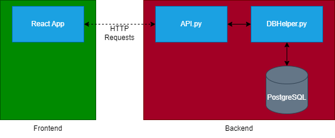

# Inventory Web app

keep track of your inventory with this simple web app!

The most CRUD app of all time! This is a template for a minimal CRUD web app, designed for speed, clarity, and easy customization. Use it as a starting point for hackathons, demos, or learning how to build and deploy a full-stack web application. You bring the ideas—this repo brings the boilerplate.

## Tech Stack

- **PostgreSQL**: Database
- **Python**: Backend language
- **FastAPI**: Backend framework
- **JavaScript**: Frontend language
- **React**: Frontend framework
- **Vite**: Frontend development tool
- **Tailwind CSS**: UI framework

You can swap FastAPI or Tailwind CSS for alternatives if you prefer.

## Features

- Register for an account
- Log in and log out
- View your inventory
- Add items with quantities
- Update item quantities
- Delete items

## Architecture



## Database Design

### Users table

| column name   | column type | primary key |
| ------------- | ----------- | ----------- |
| email         | varchar     | no          |
| password_hash | varchar     | no          |
| user_id       | bigint      | yes         |

### Items table

| column name | column type | primary key |
| ----------- | ----------- | ----------- |
| item_name   | varchar     | yes         |
| user_id\*   | bigint      | yes         |
| quantity    | int         | no          |

\*user_id will also be a forign key to Users

## Getting Started (Local)

1. Install the following:

   - Node.js & npm (for frontend)
   - Python 3.10+ (for backend)
   - PostgreSQL (for database)

2. clone this project
3. open in your VSCode
4. run the `run setup` task
5. Go into your local postgres server and set up your database

   - there is a sql script `setup.sql` in the backend folder that can help with setting up the database

6. create a `.env` file in the backend folder. Replace the placeholders with your actual values and add the following:

```
DB_URL=postgresql://<username>:<password>@<host>:<port>/<database>
```

7. create a `.env` file in the frontend folder and the following:

```
VITE_BASE_URL=http://localhost:8000
```

8. Run the `start full stack` task to start the servers. You can test logging in with the following test account:

```
alice@email.com
password
```

## Backend Development

The back end uses a very basic backend architecture.

- `API.py` — Defines all API endpoints (routes).
- `Models.py` — Contains request/response data models (Pydantic).
- `DBHelper.py` — Handles all database read/write logic.

Typical workflow:

1. Define request/response models in Models.py.
2. Add new endpoints in API.py, using your models.
3. Implement database logic in DBHelper.py as needed.

The more functionality can be added in th backend if your idea demands it and it should be very straight forward to implement it.

### API Endpoints

| method | name       | parameters                   | returns         |
| ------ | ---------- | ---------------------------- | --------------- |
| POST   | register   | email, password_hash         | success/failure |
| POST   | login      | email, password_hash         | user_id         |
| GET    | getItems   | user_id                      | list of items   |
| POST   | createItem | user_id, item_name, quantity | success/failure |
| POST   | updateItem | user_id, item_name, quantity | success/failure |
| DELETE | deleteItem | user_id, item_name           | success/failure |

## Frontend Development

The front end uses a **router** mechanism. This was choosen so that the front end does not have to constantly reload when change pages.
The template features a fairly simple frontend deisgn:

- landing page with pages for login and registration
- after logging in, you are taken to the home page and can access the bottom navigation bar
- The bottom navigation bar contains routes for other pages a logged user can access (e.g. settings)

Creating pages is simple:

1. create the page `.jsx` file in `frontend/src/pages`
2. add a route to `App.jsx` that leads to the page
3. _optional_ add link to the page in `frontend/src/components/BottomNav.jsx`

## How to deploy to Render

1. Make a render account
2. Create a project, this helps organize your services
3. Create a postgres database service
   - use the free tier (your database will eventually get deleted but in 30 days)
4. Take note of the internal database connection url and external database connection url
5. Use the external database connection url with your terminal to connect and setup your database
   - `pql <external database connection url>`
6. Create a web service, connect to your github project repo, use the following configurations:
   - Root Directory = backend
   - Build Command = pip install -r requirements.txt
   - Start Command = uvicorn API:app --host 0.0.0.0 --port $PORT
   - add an environment variables with the following details:
     - name of variable = `DB_URL`
     - value = `<internal database connection url>`
7. Create a static site, connect to your github project repo, use the following configurations:
   - Root Directory = frontend
   - Build Command = npm install && npm run build
   - Publish Directory = dist
   - add an environment variables with the following details:
     - name of variable = `VITE_BASE_URL`
     - value = `<backend web service url>`
8. Thats it your app is now deployed!
